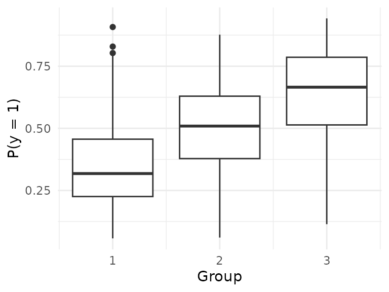

# Learning the input groups

Suppose we have a dataset with features $`X`$ and response $`y`$, and no
input grouping. Suppose we also have a small set of meaningful features
$`Z`$ that we expect to stratify observations (e.g. in biomedicine,
$`Z`$ may consist of age and sex). In this setting, we can *learn* input
groups using $`Z`$.

The steps to do this are as follows.

1.  Partition data into two sets: one to learn the grouping and one to
    do pretraining.
2.  With the first set, train a small CART tree using $`Z`$ and $`y`$.
3.  Make predictions for the remaining data; assign observations to
    groups according to their terminal nodes.
4.  Apply pretraining using the learned group assignments.

Here, we show an example using simulated data. We use `rpart` to train a
CART tree. The package `ODRF` (Liu and Xia (2022)) is another good
choice – it fits a linear model in each terminal node, which is closer
to what pretraining does, and may therefore have better performance.

    #> Loading required package: ptLasso
    #> Loading required package: ggplot2
    #> Loading required package: glmnet
    #> Loading required package: Matrix
    #> Loaded glmnet 5.0
    #> Loading required package: gridExtra

``` r

require(rpart)
#> Loading required package: rpart
```

Simulate data with a binary outcome: $`X`$ is drawn from a random normal
(with $`p = 50`$ uncorrelated features), and $`Z`$ is simulated as age
(uniform between 20 and 90) and sex (half 0, half 1). The *true* groups
are (1) age under 50, (2) age over 50 and sex = 0 and (3) age over 50
and sex = 1.

``` r

set.seed(1234)

n = 1000; p = 50
groupvars = cbind(age = round(runif(n, min = 20, max = 90)), 
                  sex = sample(c(0, 1), n, replace = TRUE))
groups = rep(1, n)
groups[groupvars[, "age"] > 50 & groupvars[, "sex"] == 0] = 2
groups[groupvars[, "age"] > 50 & groupvars[, "sex"] == 1] = 3
```

Now, we’ll define coefficients $`\beta_k`$ such that
$`P(y_i = 1 \mid x_i) = \frac{1}{1 + \exp(-x_i^T \beta_k)}`$ for each
group. Across groups, three coefficients are shared, three are
group-specific and the rest are 0. Each group has a unique intercept to
adjust its baseline risk.

``` r

beta.group1 = c(-0.5, 0.5, 0.1, c(0.1, 0.2, 0.3), rep(0, p-6)); 
beta.group2 = c(-0.5, 0.5, 0.1, rep(0, 3), c(0.1, 0.2, 0.3), rep(0, p-9)); 
beta.group3 = c(-0.5, 0.5, 0.1, rep(0, 6), c(0.1, 0.2, 0.3), rep(0, p-12)); 

x = matrix(rnorm(n * p), nrow = n, ncol = p)
x.beta = rep(0, n)
x.beta[groups == 1] = x[groups == 1, ] %*% beta.group1 - 0.75
x.beta[groups == 2] = x[groups == 2, ] %*% beta.group2 
x.beta[groups == 3] = x[groups == 3, ] %*% beta.group3 + 0.75

y = rbinom(n, size = 1, prob = 1/(1 + exp(-x.beta)))

# Now that we have our data, we will partition it into 3 datasets: 
# one to cluster, one to train models and one to test performance.
xcluster = x[1:250, ]; xtrain = x[251:750, ]; xtest = x[751:1000, ];
ycluster = y[1:250];   ytrain = y[251:750];   ytest = y[751:1000];

zcluster = groupvars[1:250, ]; 
ztrain = groupvars[251:750, ]; 
ztest = groupvars[751:1000, ];

# We will use this just to see how our clustering performed.
# Not possible with real data!
groupstrain = groups[251:750]; 
```

By design, $`P(y = 1)`$ is different across groups:

``` r

ggplot() + 
  geom_boxplot(aes(x=groups, y=1/(1 + exp(-x.beta)), group = groups)) +
  labs(x = "Group", y = "P(y = 1)") +
  theme_minimal()
```



We cluster using `rpart`. Note that we use `maxdepth = 2`: an obvious
choice because we simulated the data and we know that there is a
second-level interaction (age + sex) that determines outcome. In
general, however, we recommend keeping this tree small (`maxdepth`
smaller than 4) so that it is easily interpretable.

``` r

treefit = rpart(ycluster~., 
                data = data.frame(zcluster, ycluster), 
                control=rpart.control(maxdepth=2, minbucket=20))
treefit
#> n= 250 
#> 
#> node), split, n, deviance, yval
#>       * denotes terminal node
#> 
#> 1) root 250 61.82400 0.4480000  
#>   2) age< 50.5 111 23.18919 0.2972973 *
#>   3) age>=50.5 139 34.10072 0.5683453  
#>     6) sex< 0.5 56 13.92857 0.4642857 *
#>     7) sex>=0.5 83 19.15663 0.6385542 *
```

We want our tree to return the ID of the terminal node for each
observation instead of class probabilities. The following is a trick
that causes `predict` to behave as desired.

``` r

leaf=treefit$frame[,1]=="<leaf>"   
treefit$frame[leaf,"yval"]=1:sum(leaf)

predgroupstrain = predict(treefit, data.frame(ztrain))
predgroupstest  = predict(treefit, data.frame(ztest))
```

Finally, we are ready to apply pretraining using the predicted groups as
our grouping variable.

``` r

cvfit = cv.ptLasso(xtrain, ytrain, predgroupstrain, family = "binomial", 
                   type.measure = "auc", nfolds = 3, 
                   overall.lambda = "lambda.min")
predict(cvfit, xtest, predgroupstest, ytest = ytest)
#> 
#> Call:  
#> predict.cv.ptLasso(object = cvfit, xtest = xtest, groupstest = predgroupstest,  
#>     ytest = ytest) 
#> 
#> 
#> alpha =  0.6 
#> 
#> Performance (AUC):
#> 
#>            allGroups   mean wtdMean group_1 group_2 group_3
#> Overall       0.7049 0.6508  0.6454  0.6134  0.6722  0.6669
#> Pretrain      0.7113 0.6538  0.6473  0.5979  0.6492  0.7143
#> Individual    0.7097 0.6514  0.6464  0.6085  0.6474  0.6983
#> 
#> Support size:
#>                                       
#> Overall    5                          
#> Pretrain   6 (5 common + 1 individual)
#> Individual 20
```

Note that the overall model trained by `cv.ptLasso` takes advantage of
the clustering: it fits a unique intercept for each group. Performance
would have been much worse if we hadn’t done any clustering at all:

``` r

baseline.model = cv.glmnet(xtrain, ytrain, family = "binomial", type.measure = "auc", nfolds = 5)
assess.glmnet(baseline.model, newx=xtest, newy=ytest)$auc
#> [1] 0.6130757
#> attr(,"measure")
#> [1] "AUC"
```

Liu, Yu, and Yingcun Xia. 2022. “ODRF: Consistency of the Oblique
Decision Tree and Its Random Forest.” *arXiv Preprint arXiv:2211.12653*.
