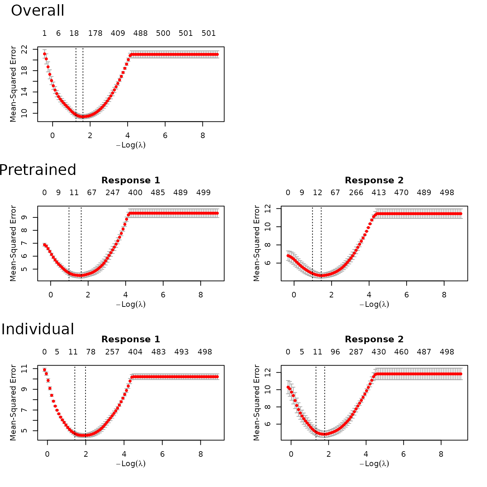

# Multi-response data with Gaussian responses

``` r

require(ptLasso)
#> Loading required package: ptLasso
#> Loading required package: ggplot2
#> Loading required package: glmnet
#> Loading required package: Matrix
#> Loaded glmnet 5.0
#> Loading required package: gridExtra
```

Multitask learning consists of data $`X`$ with two or more responses
$`y_1, \dots, y_j`$. We usually assume that there is shared signal
across the responses, and that performance can be improved by jointly
fitting models for the responses.

Here, we suppose that we wish to predict multiple **Gaussian
responses**. (If the goal is to predict multiple responses of a
different type, see the section “Multi-response data with mixed response
types”.)

Pretraining is a natural choice for multitask learning – it allows us to
pass information between models for the different responses. The
overview for our approach is to:

1.  fit a multi-response Gaussian model using a group lasso penalty
    (more below),
2.  extract the support (shared across responses) and offsets (one for
    each response), and
3.  fit a model for each response, using the shared support and
    appropriate offset.

Importantly, the group lasso penalty behaves like the lasso, but on the
whole group of coefficients for each response: they are either all zero,
or else none are zero (see the `glmnet` documentation about
`family = "mgaussian"` for more detail). As a result, the multi-response
Gaussian model is forced to choose the same support for all responses
$`y_1, \dots, y_j`$. This encourages learning *across* all responses in
the first stage; in the second stage, we find features that are specific
to each individual response $`y_k`$.

This is all done with the function `ptLasso`, using the argument
`use.case = "multiresponse"`.

We will illustrate this with simulated data with two Gaussian responses;
the two responses share the first 5 features, and they each have 5
features of their own. The two responses are quite related, with Pearson
correlation around 0.5.

``` r

set.seed(1234)

# Define constants
n = 1000         # Total number of samples
ntrain = 650     # Number of training samples
p = 500          # Number of features
sigma = 2        # Standard deviation of noise
     

# Generate covariate matrix
x = matrix(rnorm(n * p), n, p)

# Define coefficients for responses 1 and 2
beta1 = c(rep(1, 5), rep(0.5, 5), rep(0, p - 10))
beta2 = c(rep(1, 5), rep(0, 5), rep(0.5, 5), rep(0, p - 15))

mu = cbind(x %*% beta1, x %*% beta2)
y  = cbind(mu[, 1] + sigma * rnorm(n), 
           mu[, 2] + sigma * rnorm(n))

cat("SNR for the two tasks:", round(diag(var(mu)/var(y-mu)), 2))
#> SNR for the two tasks: 1.6 1.44
cat("Correlation between two tasks:", cor(y[, 1], y[, 2]))
#> Correlation between two tasks: 0.5164748

# Split into train and test
xtest = x[-(1:ntrain), ]
ytest = y[-(1:ntrain), ]

x = x[1:ntrain, ]
y = y[1:ntrain, ]
```

Now, we are ready to call `ptLasso` with our covariates `x` and response
matrix `y`, and we specify the argument `use.case = "multiresponse"`. A
call to `plot` shows the CV curves over the lasso parameter $`\lambda`$
for each model.

``` r

fit = ptLasso(x, y, use.case = "multiresponse", nfolds = 3)
plot(fit)
```



To choose the pretraining parameter $`\alpha`$, we can use `cv.ptLasso`.
Using `plot`, we can view the CV curve for pretraining together with the
overall model (multi-response Gaussian model) and the individual model
(a separate Gaussian model for each response).

``` r

fit = cv.ptLasso(x, y, nfolds = 3, use.case = "multiresponse")
plot(fit)
```

As in previous examples, we can predict using the `predict`; if `ytest`
is supplied, this will print the mean squared error as well as the
support size for the pretrained, overall and individual models using the
single $`\alpha`$ that minimizes the the average CV MSE across both
responses.

``` r

preds = predict(fit, xtest, ytest = ytest)
preds
#> 
#> Call:  
#> predict.cv.ptLasso(object = fit, xtest = xtest, ytest = ytest) 
#> 
#> 
#> 
#> alpha =  0.4 
#> 
#> Performance (Mean squared error):
#> 
#>            allGroups  mean response_1 response_2
#> Overall        9.287 4.644      4.106      5.181
#> Pretrain       8.937 4.469      4.040      4.897
#> Individual     9.388 4.694      4.168      5.220
#> 
#> Support size:
#>                                         
#> Overall    34                           
#> Pretrain   17 (17 common + 0 individual)
#> Individual 63
```

Also as before, we can choose to use the value of $`\alpha`$ that
minimizes the CV MSE for *each* response.

``` r

preds = predict(fit, xtest, ytest = ytest, alphatype = "varying")
preds
#> 
#> Call:  
#> predict.cv.ptLasso(object = fit, xtest = xtest, ytest = ytest,  
#>     alphatype = "varying") 
#> 
#> 
#> alpha:
#> [1] 0.6 0.4
#> 
#> 
#> Performance (Mean squared error):
#>            allGroups  mean response_1 response_2
#> Overall        9.287 4.644      4.106      5.181
#> Pretrain       8.959 4.479      4.062      4.897
#> Individual     9.388 4.694      4.168      5.220
#> 
#> 
#> Support size:
#>                                         
#> Overall    34                           
#> Pretrain   20 (17 common + 3 individual)
#> Individual 63
```
