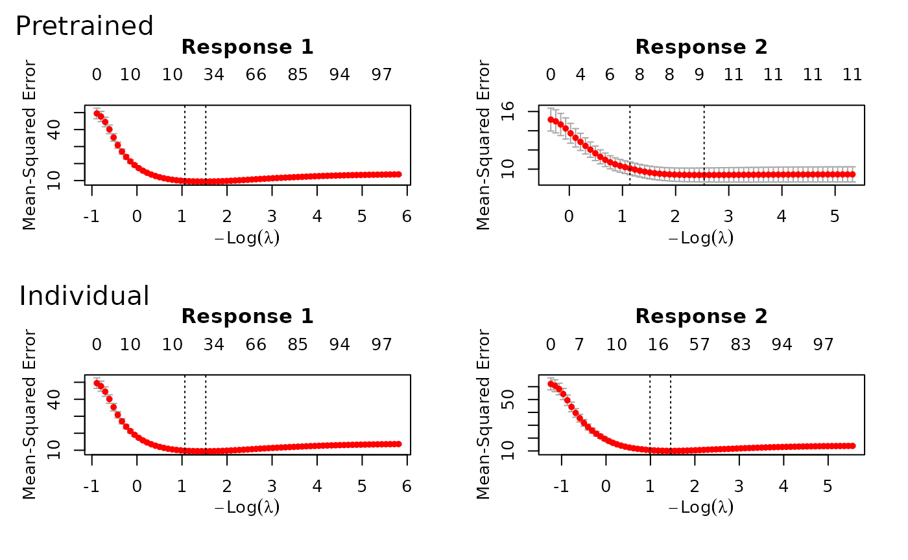
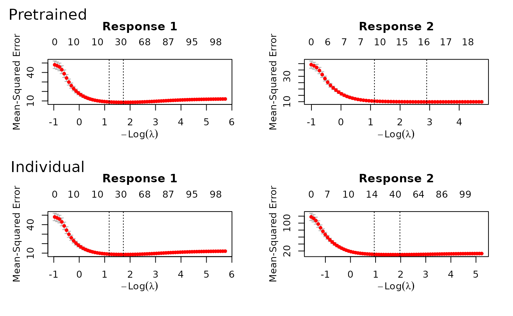

# Time series data

``` r

require(ptLasso)
#> Loading required package: ptLasso
#> Loading required package: ggplot2
#> Loading required package: glmnet
#> Loading required package: Matrix
#> Loaded glmnet 5.0
#> Loading required package: gridExtra
```

We may have repeated measurements of $`X`$ and $`y`$ across time; for
example, we may observe patients at two different points in time. We
expect that the relationship between $`X`$ and $`y`$ will be different
at time 1 and time 2, but not completely unrelated. Therefore,
pretraining can be useful: we can use the model fitted at time 1 to
inform the model for time 2.

`ptLasso` supports this setting, and below is an example. We first
assume that $`X`$ is constant across time, and $`y`$ changes. Later, we
will show an example where $`X`$ changes across time.

To do pretraining with time series data, we:

1.  fit a model for time 1 and extract its offset and support,
2.  use the offset and support (the usual pretraining) to train a model
    for time 2.

We could continue this for $`k`$ time points: after fitting a model for
time 2, we would extract the offset and support. Now, the offset will
include the offset from time 1 and the prediction from time 2; the
support will be the *union* of supports from the first two models.

## Example 1: covariates are constant over time

We’ll start by simulating data – more details in the comments.

``` r

set.seed(1234)

# Define constants
n = 600          # Total number of samples
ntrain = 300     # Number of training samples
p = 100          # Number of features
sigma = 3        # Standard deviation of noise

# Generate covariate matrix
x = matrix(rnorm(n * p), n, p)

# Define coefficients for time points 1 and 2
beta1 = c(rep(2, 10), rep(0, p - 10))  # Coefs at time 1
beta2 = runif(p, 0.5, 2) * beta1       # Coefs at time 2, shared support with time 1

# Generate response variables for times 1 and 2
y = cbind(
  x %*% beta1 + sigma * rnorm(n),
  x %*% beta2 + sigma * rnorm(n)
)

# Split data into training and testing sets
xtest = x[-(1:ntrain), ]  # Test covariates
ytest = y[-(1:ntrain), ]  # Test response

x = x[1:ntrain, ]  # Train covariates
y = y[1:ntrain, ]  # Train response
```

Having simulated data, we are ready to call `ptLasso`; the call to
`ptLasso` looks much the same as in all our other examples, only now (1)
$`y`$ is a matrix with one column for each time point and (2) we specify
`use.case = "timeSeries"`. After fitting, a call to `plot` shows the
models fitted for both of the time points with and without using
pretraining.

``` r

fit = ptLasso(x, y, use.case = "timeSeries", alpha = 0)
plot(fit)
```



And as before, we can `predict` with `xtest`. In this example,
pretraining helps performance: the two time points share the same
support, and pretraining discovers and leverages this.

``` r

preds = predict(fit, xtest, ytest = ytest)
preds
#> 
#> Call:  
#> predict.ptLasso(object = fit, xtest = xtest, ytest = ytest) 
#> 
#> 
#> 
#> alpha =  0 
#> 
#> Performance (Mean squared error):
#> 
#>              mean response_1 response_2
#> Pretrain    9.604      10.78      8.428
#> Individual 10.428      10.78     10.076
#> 
#> Support size:
#>                                          
#> Pretrain   26 (10 common + 16 individual)
#> Individual 39
```

We specified `alpha = 0` in this example, but cross validation would
advise us to choose $`\alpha = 0.2`$. Plotting shows us the average
performance across the two time points. Importantly, at time 1, the
individual model and the pretrained model are the same; we do not see
the advantage of pretraining until time 2 (when we use information from
time 1).

``` r

cvfit = cv.ptLasso(x, y, use.case = "timeSeries")
plot(cvfit)
predict(cvfit, xtest, ytest = ytest)
#> 
#> Call:  
#> predict.cv.ptLasso(object = cvfit, xtest = xtest, ytest = ytest) 
#> 
#> 
#> 
#> alpha =  0.2 
#> 
#> Performance (Mean squared error):
#> 
#>              mean response_1 response_2
#> Pretrain    9.875      10.87      8.884
#> Individual 10.447      10.87     10.027
#> 
#> Support size:
#>                                          
#> Pretrain   28 (10 common + 18 individual)
#> Individual 40
```

Note that we could also have treated this as a *multireponse* problem,
and ignored the time-ordering of the responses. See more in the section
called “Multi-response data with Gaussian responses”. (However, time
ordering can be informative, and the multi-response approach does not
make use of this.)

``` r

fit = ptLasso(x, y, use.case = "multiresponse")
```

## Example 2: covariates change over time

Now, we’ll repeat what we did above, but we’ll simulate data where $`x`$
changes with time. In this setting, `ptLasso` expects $`x`$ to be a list
with one covariate matrix for each time.

``` r

set.seed(1234)  # Set seed for reproducibility

# Define constants
n = 600          # Total number of samples
ntrain = 300     # Number of training samples
p = 100          # Number of features
sigma = 3        # Standard deviation of noise

# Covariates for times 1 and 2
x1 = matrix(rnorm(n * p), n, p)
x2 = x1 + matrix(0.2 * rnorm(n * p), n, p)  # Perturbed covariates for time 2
x = list(x1, x2)

# Define coefficients for time points 1 and 2
beta1 = c(rep(2, 10), rep(0, p - 10))  # Coefs at time 1
beta2 = runif(p, 0.5, 2) * beta1       # Coefs at time 2, shared support with time 1

# Response variables for times 1 and 2:
y = cbind(
  x[[1]] %*% beta1 + sigma * rnorm(n),
  x[[2]] %*% beta2 + sigma * rnorm(n)
)

# Split data into training and testing sets
xtest = lapply(x, function(xx) xx[-(1:ntrain), ])  # Test covariates
ytest = y[-(1:ntrain), ]  # Test response

x = lapply(x, function(xx) xx[1:ntrain, ])  # Train covariates
y = y[1:ntrain, ]  # Train response
```

Now, $`x`$ is a list of length two:

``` r

str(x)
#> List of 2
#>  $ : num [1:300, 1:100] -1.207 0.277 1.084 -2.346 0.429 ...
#>  $ : num [1:300, 1:100] -1.493 0.303 1.172 -2.316 0.224 ...
```

We can call `ptLasso`, `cv.ptLasso`, `plot` and `predict` just as
before:

``` r

fit = ptLasso(x, y, use.case = "timeSeries", alpha = 0)
plot(fit)  # Plot the fitted model
```



``` r

predict(fit, xtest, ytest = ytest)  # Predict using the fitted model
#> 
#> Call:  
#> predict.ptLasso(object = fit, xtest = xtest, ytest = ytest) 
#> 
#> 
#> 
#> alpha =  0 
#> 
#> Performance (Mean squared error):
#> 
#>             mean response_1 response_2
#> Pretrain   11.92       12.1      11.75
#> Individual 11.46       12.1      10.82
#> 
#> Support size:
#>                                          
#> Pretrain   36 (16 common + 20 individual)
#> Individual 61

# With cross validation:
cvfit = cv.ptLasso(x, y, use.case = "timeSeries")
plot(cvfit, plot.alphahat = TRUE)  # Plot cross-validated model
predict(cvfit, xtest, ytest = ytest)  # Predict using cross-validated model
#> 
#> Call:  
#> predict.cv.ptLasso(object = cvfit, xtest = xtest, ytest = ytest) 
#> 
#> 
#> 
#> alpha =  0.4 
#> 
#> Performance (Mean squared error):
#> 
#>             mean response_1 response_2
#> Pretrain   11.55      12.11      11.00
#> Individual 11.53      12.11      10.96
#> 
#> Support size:
#>                                          
#> Pretrain   54 (19 common + 35 individual)
#> Individual 65
```
